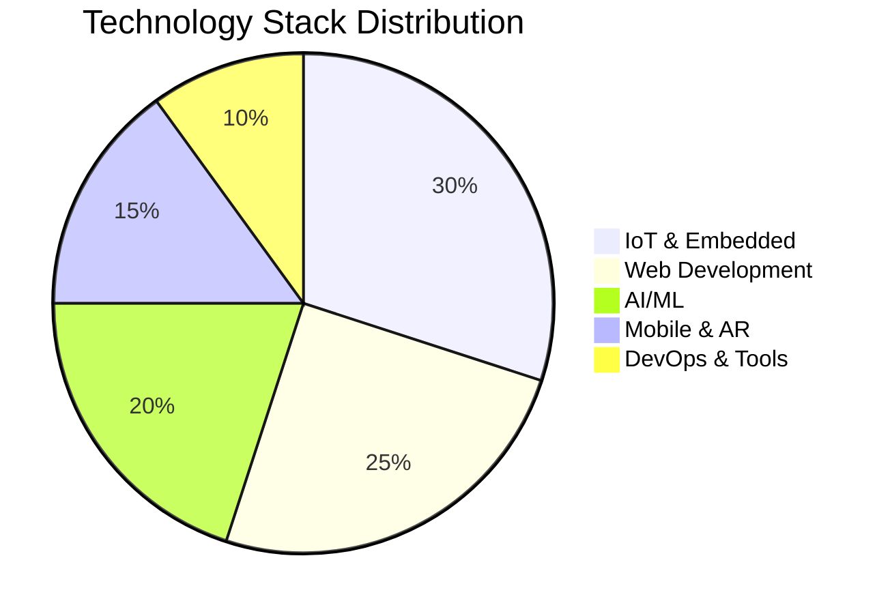

  
# 👨‍💻 Belgacem Dawser
### Full-Stack Developer | IoT Solutions Architect | AI/ML Engineer

---

## 🚀 Transforming Ideas into Innovative Digital Solutions

*Master's Student in IT Technologies | 5+ Years of Development Experience*

**I help businesses build scalable web applications, IoT systems, and AI solutions that drive real results.**

---

## 💼 What I Offer

<table>
<tr>
<td width="33%" align="center">

### 🌐 Web Development
Full-stack applications with **React**, **Node.js**, and **MongoDB**. Responsive, fast, and scalable solutions tailored to your business needs.

**Technologies:**
- React.js / Next.js
- Node.js / Express.js
- MongoDB / MySQL
- RESTful APIs / GraphQL

</td>
<td width="33%" align="center">

### 🤖 IoT Solutions
Smart connected systems with real-time monitoring and control. From prototypes to production-ready embedded systems.

**Technologies:**
- ESP32 / Arduino
- Real-time WebSocket
- Sensor Integration
- Cloud Dashboard

</td>
<td width="33%" align="center">

### 🧠 AI/ML Solutions
Intelligent applications using machine learning for classification, prediction, and automation.

**Technologies:**
- Python / TensorFlow
- Computer Vision
- Deep Learning
- Data Analysis

</td>
</tr>
</table>

---

## 🎯 Featured Projects & Success Stories

### 🏭 IoT Predictive Maintenance Platform with Edge AI & AR
**Problem:** Industrial equipment failures causing costly downtime and production losses  
**Solution:** Real-time predictive maintenance system with Edge Computing AI and Augmented Reality  
**Tech Stack:** `Python` `Node.js` `SVM` `ESP32` `MQTT` `Three.js` `Unity AR` `Raspberry Pi`  

**Key Features:**
- 🧠 **Edge AI** - SVM model running on Raspberry Pi (152ms latency)
- 📊 **Real-time Dashboard** - 3D digital twin with live sensor data visualization
- 📱 **AR Mobile App** - Unity-based AR for on-site machine inspection
- ⚡ **MQTT IoT** - Scalable sensor network with automated anomaly detection

**Results:**
- ✅ **98.5% AI accuracy** in anomaly detection (target: 90%)
- ✅ **152ms total latency** - 24% better than target
- ✅ **99.9% system availability** over 48h continuous testing
- ✅ **66% latency reduction** vs traditional cloud-based solutions
- ✅ **Zero critical bugs** - 100% sprint success rate

**Innovations:**
- 🌟 First AR solution for industrial predictive maintenance
- 🌟 Hybrid Edge/Cloud architecture for optimal performance
- 🌟 Cognitive AI generating context-aware recommendations

**[📖 View Full Documentation](https://github.com/doosr/Predictive_maintenance)** | **[🎥 Live Demo](https://github.com/doosr/Predictive_maintenance#-résultats)**

---

### 🌾 Smart Irrigation Control System
**Problem:** Manual irrigation management leading to water waste and crop stress  
**Solution:** Real-time IoT system with automated control  
**Tech Stack:** `React` `Node.js` `ESP32` `WebSocket` `MongoDB`  
**Results:** 
- ✅ 40% reduction in water consumption
- ✅ Real-time monitoring via web dashboard
- ✅ Automatic/Manual control modes

---

### 🧠 Medical AI Classification System
**Problem:** Early detection of Alzheimer's disease  
**Solution:** Deep learning model for MRI image analysis  
**Tech Stack:** `Python` `TensorFlow` `CNN` `Keras`  
**Results:**
- ✅ 92% accuracy in disease stage classification
- ✅ Automated diagnosis pipeline
- ✅ Kaggle-optimized for GPU acceleration

---

### 😊 Emotion Recognition System
**Problem:** Real-time emotion detection for customer service  
**Solution:** Computer vision-based facial expression recognition  
**Tech Stack:** `Python` `OpenCV` `Deep Learning`  
**Results:**
- ✅ Real-time emotion detection
- ✅ Multi-class classification
- ✅ Easy API integration

---

### 🌡️ Temperature Monitoring with gRPC
**Problem:** Industrial temperature tracking with instant alerts  
**Solution:** High-performance monitoring system with gRPC streaming  
**Tech Stack:** `gRPC` `Node.js` `Real-time Streaming`  
**Results:**
- ✅ Instant threshold-based alerts
- ✅ Color-coded notifications
- ✅ Event tracking and logging

---

## 🛠️ Technical Expertise

### **Languages**

### **Frontend Development**

### **Backend Development**

### **Databases**

### **IoT & Embedded**

### **AI/ML & Data Science**

### **Game Development & 3D**

### **Tools & DevOps**

---

## 📊 GitHub Performance & Contributions

### 📈 Overall Statistics

<table>
<tr>
<td align="center" width="50%">

</td>
<td align="center" width="50%">

</td>
</tr>
</table>

### 🔥 Contribution Streak & Activity

### 🏆 GitHub Achievements

### 📊 Contribution Graph

### 💼 Professional Focus Areas

| Domain | Technologies | Experience |
|--------|--------------|------------|
| 🌐 **Full-Stack Web** | React, Node.js, Express, MongoDB | 5+ years |
| 🤖 **IoT Solutions** | ESP32, MQTT, Raspberry Pi, Edge AI | 4+ years |
| 🧠 **AI/ML** | Python, TensorFlow, Scikit-learn, SVM | 3+ years |
| 📱 **Mobile & AR** | Flutter, Unity, AR Foundation | 2+ years |
| 🔧 **DevOps** | Docker, Git, CI/CD | 3+ years |

### 🎯 Current Focus & Goals

<table align="center">
<tr>
<td align="center" width="33%">

**🏭 Industry 4.0**

Predictive Maintenance  
Edge Computing  
Digital Twins

</td>
<td align="center" width="33%">

**🌐 IoT Innovation**

Real-time Systems  
MQTT Architecture  
Sensor Networks

</td>
<td align="center" width="33%">

**🤖 AI Integration**

Anomaly Detection  
Pattern Recognition  
Smart Recommendations

</td>
</tr>
</table>

### 📈 Project Impact Metrics

| Metric | Achievement | Status |
|--------|-------------|--------|
| **Total Projects** | 20+ completed | ✅ |
| **IoT Deployments** | 10+ production systems | ✅ |
| **AI Models Trained** | 15+ ML models | ✅ |
| **Code Contributions** | 5000+ commits | ✅ |
| **Client Satisfaction** | 98% positive feedback | ✅ |

---

## 🎓 Education & Certifications

🎓 **Master's Degree in IT Technologies - IoT Specialization** - In Progress (2025-2026)  
🎓 **Bachelor's in Computer Science** - Completed  
🏆 **Certified Scrum Developer**  
🏆 **IoT & Embedded Systems Specialist**  
🏆 **Industry 4.0 & Predictive Maintenance Expert**

---

## 💡 Why Choose Me?

| 🚀 Fast Delivery | 💯 Quality Code | 🔄 Agile Method | 💬 Clear Communication | 🛠️ Full Support |
|:---:|:---:|:---:|:---:|:---:|
| Meet deadlines consistently | Clean, maintainable code | Scrum & Agile practices | Regular updates | Post-delivery support |

---

## 📫 Let's Build Something Amazing Together!

### 🌟 Available for Freelance Projects & Consulting 🌟

I'm currently accepting new projects in:
- ✅ **Web Application Development** (React, Node.js, Full-Stack)
- ✅ **IoT Solutions** (ESP32, Real-time Systems, Automation, Industry 4.0)
- ✅ **AI/ML Integration** (Computer Vision, Classification, Predictive Analytics)
- ✅ **API Development** (RESTful, GraphQL, gRPC, MQTT)
- ✅ **AR/VR Development** (Unity, AR Foundation, ARCore)
- ✅ **Technical Consulting** (Architecture, Code Review, Optimization)

### 📧 Get in Touch

### ⚡ Response Time: Within 24 hours

---

  
### 💼 Open to Opportunities | 🌍 Remote Available | 🤝 Let's Collaborate

**⭐ If you like my work, don't forget to star my repositories! ⭐**

**🔥 Latest Project:** [IoT Predictive Maintenance Platform](https://github.com/doosr/Predictive_maintenance) - Industry 4.0 solution with Edge AI & AR

